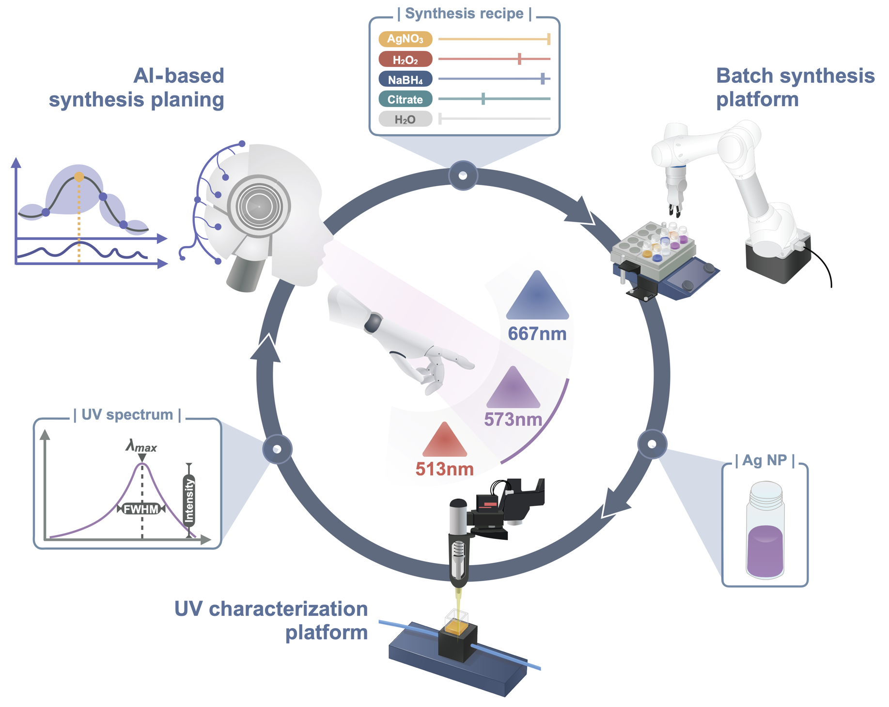
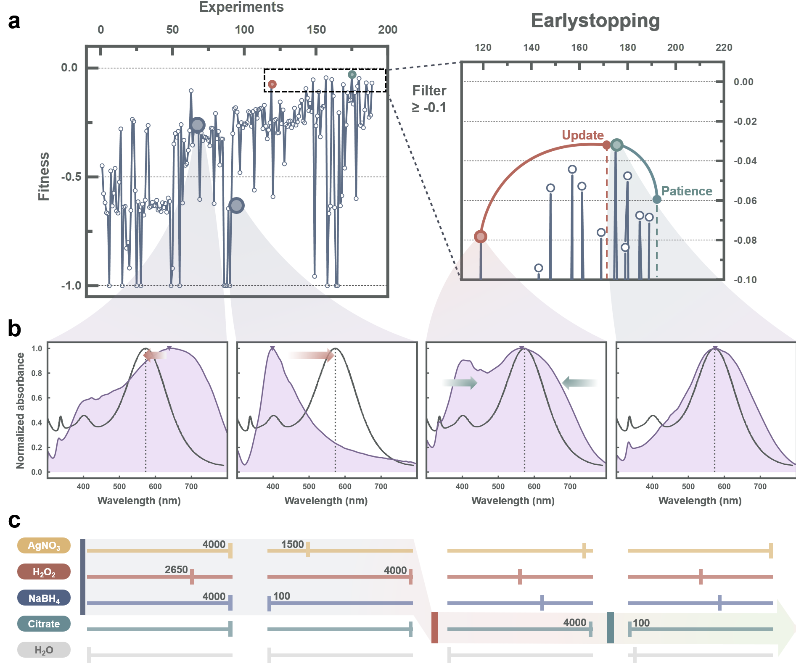
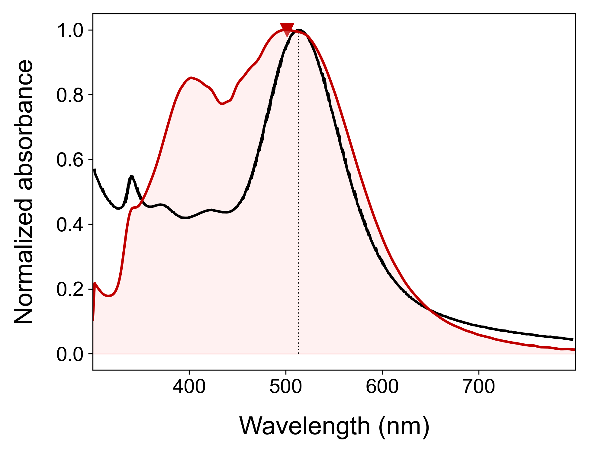
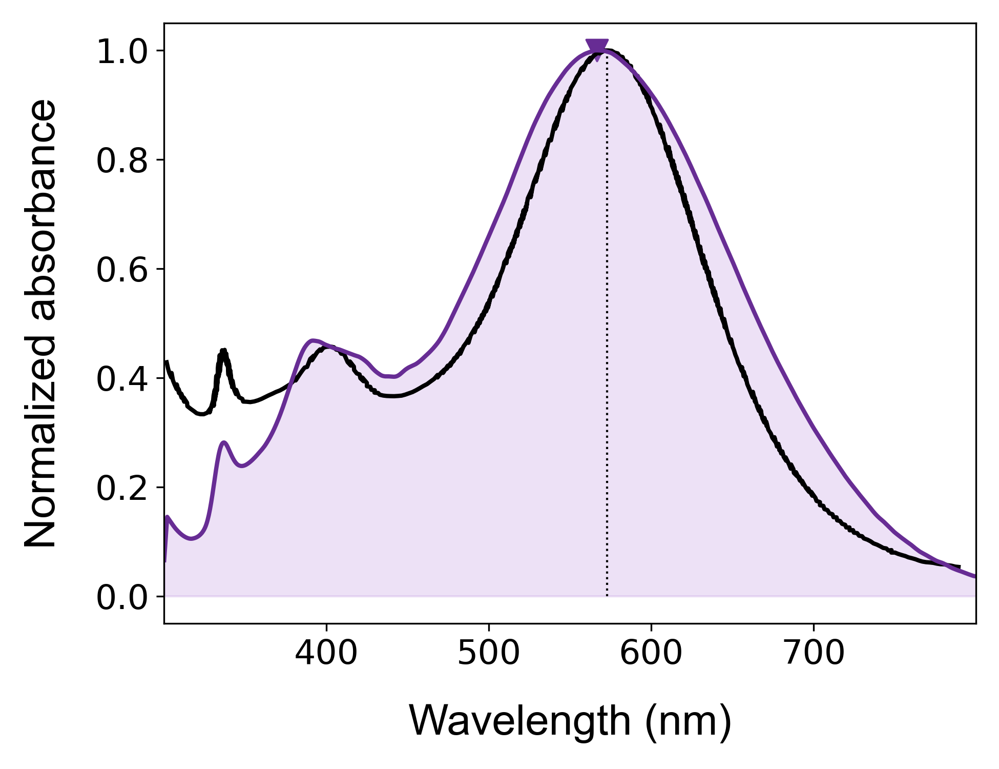
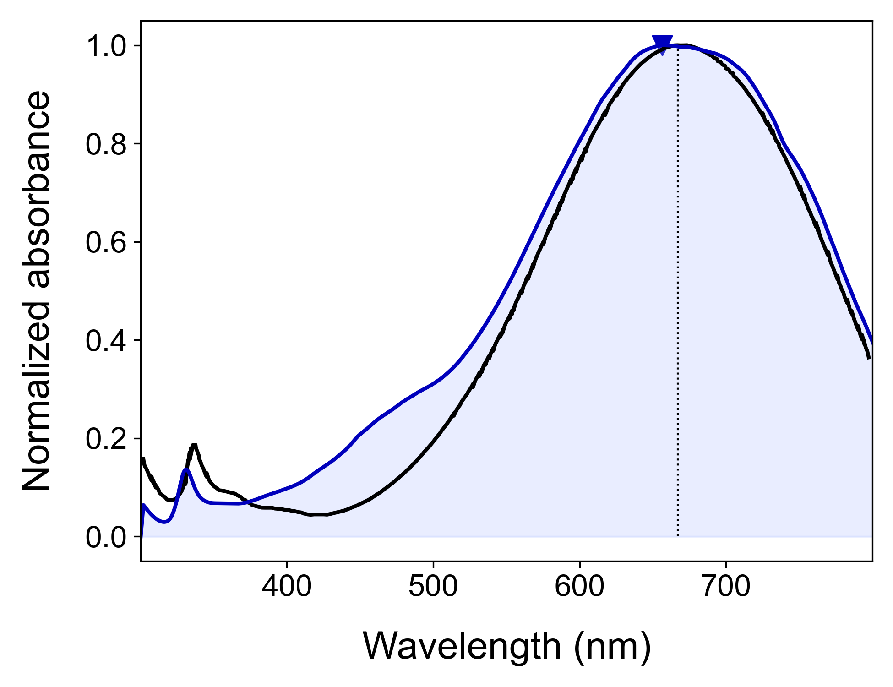

# 1. Chemistry discovery in nanoparticle synthesis via autonomous laboratory

## Introduction

>The demand for bespoke nanoparticles has been increased significantly in many applications because of tunable properties depending on the synthesis process. Therefore, autonomous laboratory with AI and robotics has been rapidly investigated for time-consuming and labor-intensive nanoparticle synthesis. This approach not only accelerate the nanoparticle synthesis for desired properties with saving cost and time, but also help to understand synthesis-property relationships through just experimental data. Although autonomous laboratory already offers the optimized environment for extraction from synthesis-property relationships to chemical knowledge, yet scientific study to find substantial chemistry knowledge is insufficient in previous efforts. Here, we developed autonomous laboratory to customize commercial Ag nanoplate of optical properties. Bayesian optimization with earlystopping highly improved the accuracy and search efficiency of bespoke synthesis less than 200 experiments. Also, SHAP analysis and visualization of AI-decision process can show understanding of AI-based synthetic route without human intuition. Furthermore, we could derive chemistry discovery about citrate effect, which affect shape evolution through additional manual synthesis. Our advances show the possibility of generative system for novel chemical knowledge in only training experimental data via autonomous laboratory.

## Schematic design of bespoke nanoparticle synthesis via autonomous laboratory

  

## Bayesian optimization with Earlystopping

  

## Target result

We target three nanoparticles in [this literature](https://www.sciencedirect.com/science/article/pii/S2468217921000125). This target nanopalte is known to improve the performance of organic solar cell. Therefore, we tried to challenge bespoke nanoparticle synthesis. Here is our the results.

## Fitness function

$$/text{Fitness function [-1, 0]} = -0.9 * {(λ_{max} – λ_{max, target})/over A_{λ_{max}}} -0.07*(1-intensity) -0.03*{/text{FWHM}/over A_{FWHM}}$$

### 1. 513nm

**UV spectrum image**

  

**AI-decision proccess**

  

### 2. 573nm

**UV spectrum image**

  

**AI-decision proccess**

  

### 3. 667nm

**UV spectrum image**

  

**AI-decision proccess**

  

## Reference
1. Phengdaam, Apichat, et al. "Improvement of organic solar cell performance by multiple plasmonic excitations using mixed-silver nanoprisms." Journal of Science: Advanced Materials and Devices 6.2 (2021): 264-270.
